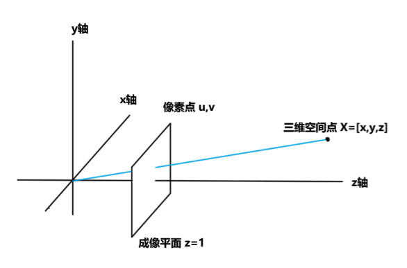
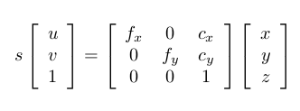
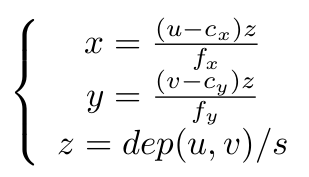
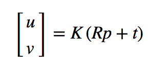
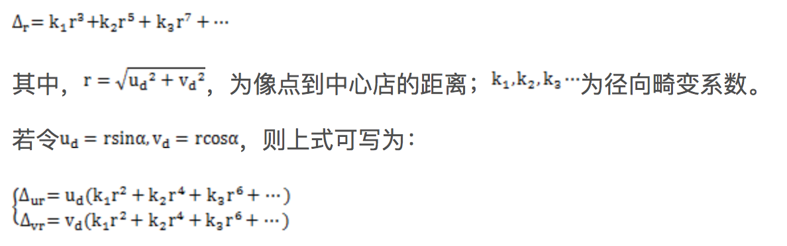
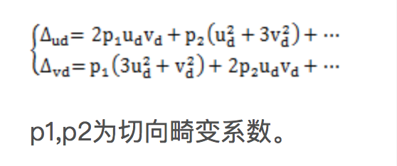
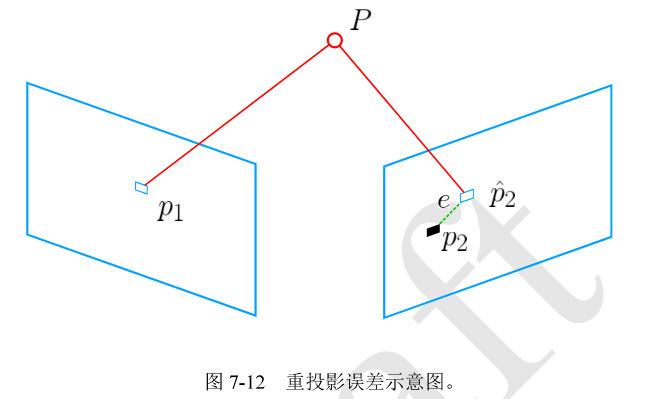
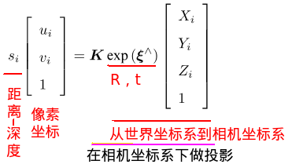
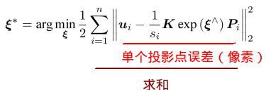
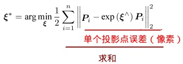

# slam-learning

SLAM是一个比较庞杂的系统工程，经典的视觉SLAM一般包括：Visual Odometry、Optimization、Loop Closing、Mapping。
本项目通过学习高翔的视觉SLAM十四讲，对SLAM中的VO和Back End进行实践。

## 视觉里程计

对于视觉里程计来说，一般是计算相邻关键帧的相机运动，进而估计出关键帧体现出来的相机位姿。

本项目通过RGBD图像获得原始数据，使用了PnP和ICP两种方式，实现了相机位姿的旋转矩阵R和转移矩阵T。

## 算法原理

### 相机模型

1. 内参

在这个相机模型中，空间点X=[x,y,z]，它投影在相机平面，并产生了一个像素p=[u,v]。
假设相机光圈中心对准z轴，成像平面位于z=1处，那么根据下图描述的关系，投影方程即为：

其中：
* s为缩放因子，可以理解为参考缩放值，可以通过它的值设定出米、厘米、毫米等尺度。
* fx、fy为相机x轴和y轴上的焦距，单位为像素。
* cx、cy为主点坐标，既三维像素坐标原点与成像平面上的投影与成像平面左上角的距离。

因此，他们的换算关系如下：

2. 外参
相机的外参既为R(旋转矩阵)、T(平移矩阵)，代表着相机在3D世界里的位姿。
对于2D-3D的转换关系，有如下公式（K为相机内参）：

更多位姿知识请参见：
[3D空间的位置表示](http://www.cnblogs.com/gaoxiang12/p/5113334.html)

3. 畸变
由于相机为了获得更大的视野，往往在其前面添加透镜，由于透镜本身会对光线产生不同的折射作用，同时也会与成像平面存在着平行误差。
所以对透镜的畸变引入径向畸变和切向畸变
* 径向畸变

* 切向畸变

k1、k2、k3、p1、p2共同组成了畸变系数。
一般通过标定后的相机在获取图像后都会进行去畸变处理，所以在本项目中使用的图像也都是去畸变的，无需再做畸变转换。

### G2O
G2O是google关于图优化理论的工程实现工具，关于图优化理论请详见：
[G2O图优化](http://www.cnblogs.com/gaoxiang12/p/5304272.html)

### PnP

PnP(Perspective-n-Point)n点投影，是求解3D-2D关键点运动时的方法，在得知n个3D空间点和对应的像素未知时，估计出相机的位姿。
通过使用Bundle Adjustment方法构建一个李群上的非线性最小二乘问题。

假设我们通过特征匹配到两个关键帧上的一对像素点p1、p2，接下来将第一个关键帧的p1投影到空间像素P上后，
在通过P反投影到第二个关键帧p2^上，而p2^与p2的误差，既称为重投影误差：

投影关系式为：

对于反投影的误差来说，就是p2与p2^之间的差，对于多个特征点对来说，那么就有：

我们的优化目标就是使这个误差之和最小的情况下，求出最优的R和t。

### ICP

ICP(Iterative Closest Point)迭代最近点，一般在无相机模型的情况下采用的方式，比如激光传感器，不过由于激光获得的是点云数据，
特征不太丰富，我们一般无法精确的得出两个点集之间的匹配关系，因此一般都会将点云数据进行归一三位化后，进行距离计算，如果两个点云的距离比较接近，
那么既认为为同一匹配。

对于ICP的Bundle Adjustment，我们是通过不断迭代匹配点对来寻找最优的位姿的。公式的其它定义与PnP类似，目标函数可以取消相机内参影像，写成:

## VO项目实现

## 后端优化

由于各种误差（传感器数据、标定数据、计算误差、噪声）的存在，视觉里程计所得出的位姿值和实际值会出现较小的不一致，
当这些误差随着时间累积起来后，就会出现Drift现象，这时需要使用后端优化来重新评估之前的位姿值，使误差收敛。
为后期的Mapping建立基础。

本项目通过使用G2O对多个相机所观测的特征点进行非线性的后端优化，最终得到收敛后的位姿和特定空间点。

## 优化实现