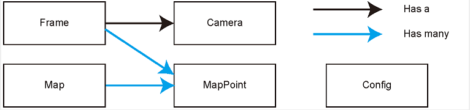
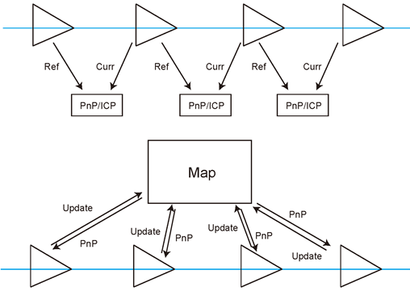

# slam-learning

SLAM是一个比较庞杂的系统工程，经典的视觉SLAM一般包括：Visual Odometry、Optimization、Loop Closing、Mapping。
本项目通过学习高翔的视觉SLAM十四讲，对SLAM中的VO和Back End进行实践。

## 视觉里程计

对于视觉里程计来说，一般是计算相邻关键帧的相机运动，进而估计出关键帧体现出来的相机位姿。

本项目通过RGBD图像获得原始数据，使用了PnP和ICP两种方式，实现了相机位姿的旋转矩阵R和转移矩阵T。

## 算法原理

### 相机模型

1. 内参

在这个相机模型中，空间点X=[x,y,z]，它投影在相机平面，并产生了一个像素p=[u,v]。
假设相机光圈中心对准z轴，成像平面位于z=1处，那么根据下图描述的关系，投影方程即为：

其中：
* s为缩放因子，可以理解为参考缩放值，可以通过它的值设定出米、厘米、毫米等尺度。
* fx、fy为相机x轴和y轴上的焦距，单位为像素。
* cx、cy为主点坐标，既三维像素坐标原点与成像平面上的投影与成像平面左上角的距离。

因此，他们的换算关系如下：

2. 外参
相机的外参既为R(旋转矩阵)、T(平移矩阵)，代表着相机在3D世界里的位姿。
对于2D-3D的转换关系，有如下公式（K为相机内参）：

更多位姿知识请参见：
[3D空间的位置表示](http://www.cnblogs.com/gaoxiang12/p/5113334.html)

3. 畸变
由于相机为了获得更大的视野，往往在其前面添加透镜，由于透镜本身会对光线产生不同的折射作用，同时也会与成像平面存在着平行误差。
所以对透镜的畸变引入径向畸变和切向畸变
* 径向畸变

* 切向畸变

k1、k2、k3、p1、p2共同组成了畸变系数。
一般通过标定后的相机在获取图像后都会进行去畸变处理，所以在本项目中使用的图像也都是去畸变的，无需再做畸变转换。

### G2O
G2O是google关于图优化理论的工程实现工具，关于图优化理论请详见：
[G2O图优化](http://www.cnblogs.com/gaoxiang12/p/5304272.html)

### PnP

PnP(Perspective-n-Point)n点投影，是求解3D-2D关键点运动时的方法，在得知n个3D空间点和对应的像素未知时，估计出相机的位姿。
通过使用Bundle Adjustment方法构建一个李群上的非线性最小二乘问题。

假设我们通过特征匹配到两个关键帧上的一对像素点p1、p2，接下来将第一个关键帧的p1投影到空间像素P上后，
在通过P反投影到第二个关键帧p2^上，而p2^与p2的误差，既称为重投影误差：

投影关系式为：

对于反投影的误差来说，就是p2与p2^之间的差，对于多个特征点对来说，那么就有：

我们的优化目标就是使这个误差之和最小的情况下，求出最优的R和t。

### ICP

ICP(Iterative Closest Point)迭代最近点，一般在无相机模型的情况下采用的方式，比如激光传感器，不过由于激光获得的是点云数据，
特征不太丰富，我们一般无法精确的得出两个点集之间的匹配关系，因此一般都会将点云数据进行归一三位化后，进行距离计算，如果两个点云的距离比较接近，
那么既认为为同一匹配。

对于ICP的Bundle Adjustment，我们是通过不断迭代匹配点对来寻找最优的位姿的。公式的其它定义与PnP类似，目标函数可以取消相机内参影像，写成:

## 后端优化

由于各种误差（传感器数据、标定数据、计算误差、噪声）的存在，视觉里程计所得出的位姿值和实际值会出现较小的不一致，
当这些误差随着时间累积起来后，就会出现Drift现象，这时需要使用后端优化来重新评估之前的位姿值，使误差收敛。
为后期的Mapping建立基础。

本项目通过使用G2O对多个相机所观测的特征点进行非线性的后端优化，最终得到收敛后的位姿和特定空间点。

## VO功能实现

### 工程框架

本项目的输入数据为调畸后的RGB-D图像，工程根目录的组织如下：
1. bin 存放生成的二进制可执行程序。
2. config 用于定义相机外参、数据文件路径、可变参数等信息。
3. data 存储RGB-D图像文件和映射文件。
4. include 程序头文件
   * common 为共用部分代码的源文件头。
   * g2o 为G2O的自定义头文件。
5. lib 存放编译好的库文件。
6. src 存放源代码文件，是.cpp文件。
7. test 存放测试用的文件，是.cpp文件。
8. cmake_modules 第三方库的cmake文件，在使用g2o之类的库时会用到它。

### 数据结构组织

项目内定义路标点、相机、帧、地图、配置等数据结构：

Frame: 关键帧。在计算过程中，图像是已帧为单位存储在内存中的，它包括特征点、位姿、相机内参等属性。
关键帧通过配置文件中的keyframe_rotation和keyframe_translation设置的阀值来控制，只有大于阀值的之间的帧才能定为关键帧。

Camera: 相机模型。包括相机的内参属性。在项目中经常要进行坐标变换计算，例如，世界坐标到相机坐标、相机坐标到归一化相机坐标、归一化相机坐标到像素坐标，等等。
因此，将这个这些方法定义Camera中使用起来会更方便。

MapPoint: 路标点。路标既图像中的特征点。在相机运动后，我们还能估计它们的3D位置。
通常，会把路标点放在一个地图当中，并将新来的帧与地图中的路标点进行匹配，估计相机位姿。

Map: 局部地图。局部地图包含上一个关键帧map和特征点map。用于对附近路标点进行管理。

Config: 配置类。读取配置文件中的变量，方便其它方法使用其变量值。

他们的关系图如下：

### 特征提取及匹配

对于相邻的两帧，前一帧定义为参考帧，后一帧定义为当前帧，特征提取如下：

1. 对当前帧提取特征点及描述子
2. 如果当前帧为第一帧，则将这帧设为一参考帧，并计算该帧中特征点的3D空间位置，并开始下一循环。
3. 估算出当前帧与参考帧之间的相对运动R和T。
4. 如果未得出运动估计值，则设置并检查流失次数，如果丢失次数超过max_num_lost阀值，则结束循环。

当匹配后的特征点满足最小特征点阀值时，我们就将这帧及其特征点加入到全局地图中，直到程序结束。

### 特征点位姿优化

此步骤是通过特征点来优化位姿，因此在图优化中，只需要设置一个一元边即可。
* 对于PnP方式，我们定义G2O边EdgeProjectXYZ2UVPoseOnly的误差和雅可比矩阵。
使用cv::solvePnPRansac来获得特征点位姿的初始值。
* 对于ICP方式，我们定义G2O边EdgeProjectXYZRGBDPoseOnly的误差和雅可比矩阵。
使用假设的固定位姿来设定位姿初始值。

### 局部地图更新

通过提取关键帧和其中的特征点，我们会将新产生的特征点添加到全局地图中，方便后续循环过程中对特征点的查找和匹配，
这样会较大减少特征点的匹配时间。

以上三步的流程为下图所示：

## 后端优化功能实现

### 
